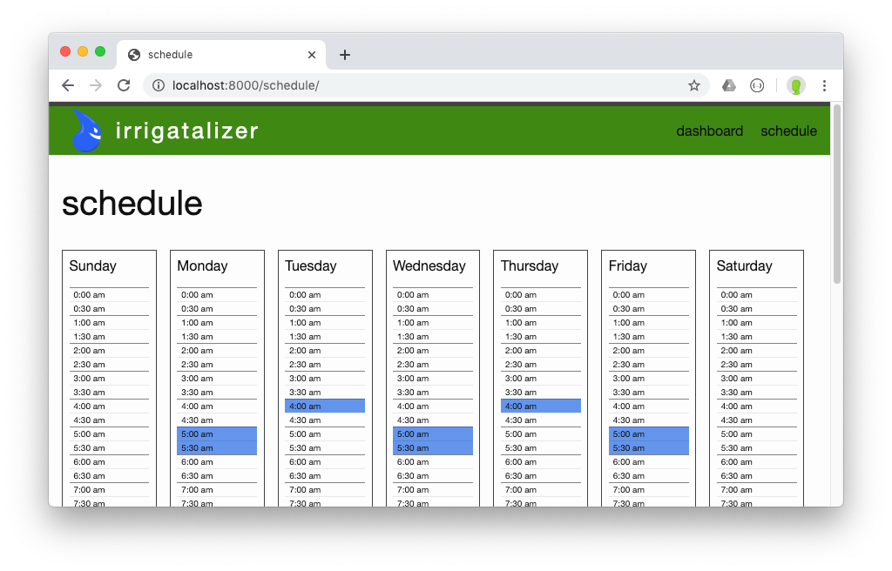
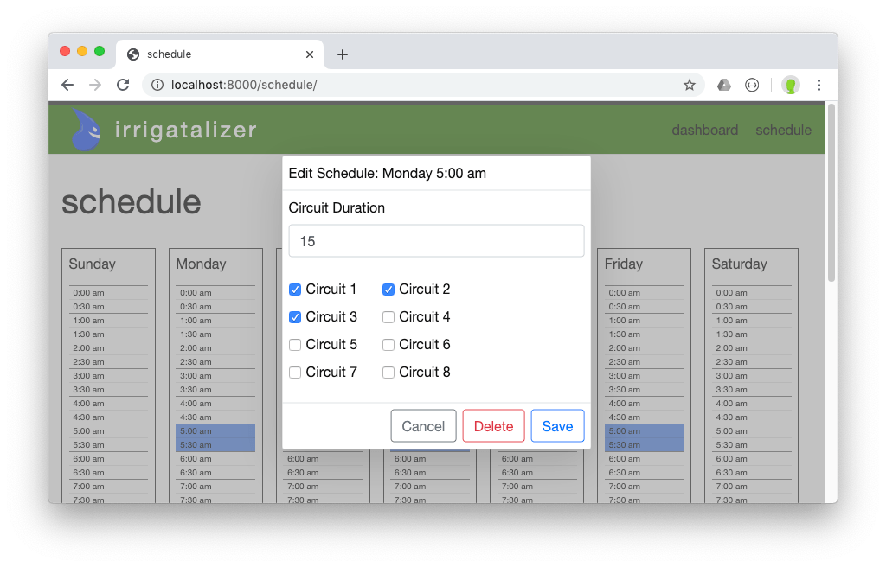
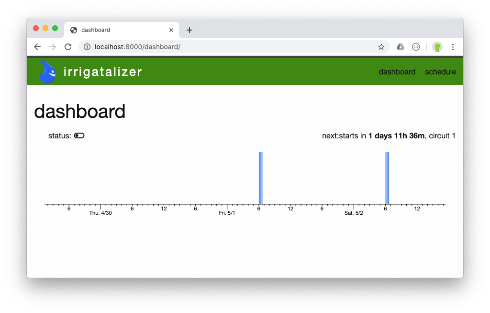

## About

This project provides a NodeJS application for operating a Raspberry Pi that drives an irrigation system via GPIO pins, with two major components:

1. A web UI for configuring an irrigation schedule
2. A scheduler that turns GPIO pins on and off

### Status

This project is in the early stages. Lots of features are missing.

Continuous Integration: 

### Related

There are several related projects out there, most of which are more mature, have more features and are better supported:

- [Open Sprinkler](https://github.com/OpenSprinkler)
- [Raspberry Pi Controlled Irrigation System (Instructables)](https://www.instructables.com/id/Raspberry-Pi-Controlled-Irrigation-System/)
- [SIP (Sustainable Irrigation Platform)](https://dan-in-ca.github.io/SIP/)

## Application

### Configuration

The irrigation schedule can be configured using a web browser. Normally this would occur over WiFi by having your computer or phone on the same wireless network as the Raspberry Pi.

#### Schedule



Click on the schedule to add or remove a scheduled watering:



#### Dashboard



### Start

```sh
$ node index.js
Server listening on port 8000...
```

It's recommended to use a NodeJS process management system to ensure that the process runs as a daemon. Examples are [pm2](https://pm2.io) and [forever](https://github.com/foreversd/forever).

### Start Development Mode

Development mode rebuilds the application when files are changed, to enable quick experimentation.

```sh
$ npm run start-dev
Server listening on port 8000...
```

## Pi Setup

### NodeJS 12

Follow Debian instructions here: [github.com/nodesource/distributions](https://github.com/nodesource/distributions/blob/master/README.md)

### Daemon and Process Management

Install [pm2](https://pm2.io):

```sh
sudo npm install pm2 -g
pm2 startup
```

Follow [pm2](https://pm2.io) instructions to setup pm2 to start with systemd

#### Configure pm2

```sh
pm2 start index.js --name irrigatalizer
```

#### Handy pm2 Commands

```sh
pm2 ls
pm2 stop irrigatalizer
pm2 start irrigatalizer
pm2 save
pm2 monit
pm2 logs
```

### Networking

#### Firewall and Port 80

Redirect port 80 to port 8000 so that root access is not needed:

```sh
sudo iptables -t nat -I PREROUTING -p tcp --dport 80 -j REDIRECT --to-port 8000
```

Also see [saving-iptables-firewall-rules-permanently](https://discourse.osmc.tv/t/saving-iptables-firewall-rules-permanently/7286/7) to have that stick on reboot.

#### SSH

[Raspberry Pi SSH Setup](https://www.greensopinion.com/2020/04/26/raspberry-pi-ssh-setup.html)

## License

Copyright 2020 David Green

Licensed under the Apache License, Version 2.0 (the "License"); you may not use this file except in compliance with the License. You may obtain a copy of the License at

http://www.apache.org/licenses/LICENSE-2.0

Unless required by applicable law or agreed to in writing, software distributed under the License is distributed on an "AS IS" BASIS, WITHOUT WARRANTIES OR CONDITIONS OF ANY KIND, either express or implied. See the License for the specific language governing permissions and limitations under the License.
